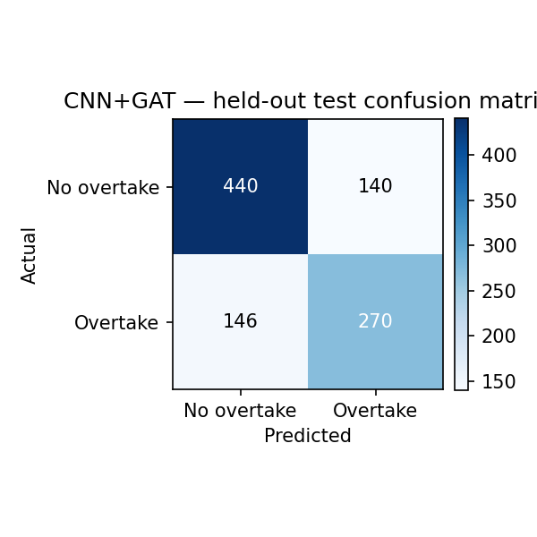
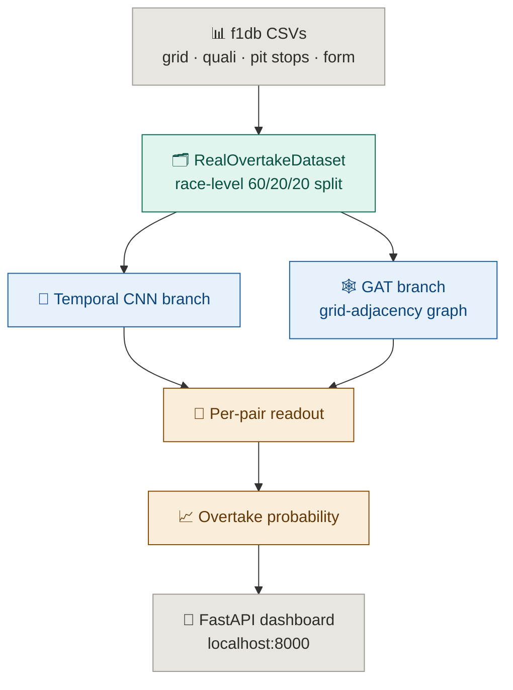

<div align="center">

[](#)


# ApexNet — F1 Overtaking Prediction

**Given two drivers starting next to each other on the grid, will the one behind finish ahead?**

ApexNet trains five deep-learning architectures on real historical Formula 1 race results (f1db, 2014+) to predict grid-adjacent overtaking outcomes — with a leakage-checked train/val/test split, a held-out confusion matrix, and a feature-ablation study, then replays real races through a live dashboard so predictions can be checked against what actually happened.

</div>

---

## The Problem

Predicting race outcomes with deep learning is the obvious assignment framing — but the obvious data for it, sub-lap car telemetry (speed/throttle/brake/DRS at several Hz), isn't legally or technically reachable from this project's network access. FastF1 and the F1 live-timing API are both unreachable here.

Most projects solve that by quietly synthesizing telemetry and presenting it as real, or by not mentioning the gap at all.

## The Solution

ApexNet reframes the task around data that **is** real: grid position, qualifying gap, pit-stop lap numbers, and leakage-checked rolling season form, pulled from f1db's public race-results archive — no fabricated signal anywhere in the pipeline.

Instead of predicting a short telemetry window the data can't support, it predicts a real, race-long, binary outcome: **does the driver who starts behind a given rival finish ahead of them by the flag.**

---

## Core Prediction Flow

```
Real f1db race results (grid, quali, pit stops, rolling season form)
        ↓
Race-level 60/20/20 train/val/test split (no pair leaks across splits)
        ↓
Temporal CNN branch  +  GAT branch over the grid-adjacency graph
        ↓
Per-pair overtake probability
        ↓
Confusion matrix · Precision/Recall/Specificity · F1 · AUC
        ↓
Live dashboard replay against the real historical race
```

---

## Features

| Feature | Status |
|---|---|
| Real historical training data (f1db, no synthetic telemetry) | ✅ |
| Race-level 60/20/20 train/val/test split (leakage-checked) | ✅ |
| 5 architectures trained on identical data/split | ✅ |
| Confusion matrix, precision, recall, specificity, F1, AUC | ✅ |
| Feature-group ablation study | ✅ |
| Dataset distribution + class balance (computed, not hand-typed) | ✅ |
| Published-literature comparison, dataset mismatch stated honestly | ✅ |
| Live replay dashboard against real race results | ✅ |

---

## Results Snapshot

Every jewellery type in Velaris renders a distinct silhouette; every architecture here gets an identical evaluation on the same held-out test set — so the numbers are directly comparable:

| Model | Accuracy | Precision | Recall | Specificity | F1 | AUC |
|---|--:|--:|--:|--:|--:|--:|
| CNN | 0.723 | 0.698 | 0.594 | 0.816 | 0.642 | 0.795 |
| GAT | 0.723 | 0.706 | 0.577 | 0.828 | 0.635 | 0.798 |
| LSTM | 0.726 | **0.754** | 0.510 | **0.881** | 0.608 | 0.779 |
| CNN+LSTM | 0.705 | 0.662 | 0.599 | 0.781 | 0.629 | 0.780 |
| **CNN+GAT (proposed)** | 0.713 | 0.659 | **0.649** | 0.759 | **0.654** | 0.795 |

Held-out test set, 275 races → 159/53/53 train/val/test, seed=42, ~42-43% positive rate in every split (not imbalance-inflated).

**Honest read:** LSTM is the most conservative model — best accuracy and precision, worst recall. CNN+GAT is the best F1/recall trade-off, not an outright winner on every metric. Which one is "correct" depends on whether missing a real overtake or raising a false alarm is costlier for the use case.

<p align="center"></p>

---

## Live Replay Dashboard

Every race replays with a distinct real grid, real pit-stop laps, and real final classification — the dashboard doesn't reuse a template:

| Element | Real or derived | Source |
|---|---|---|
| Starting grid | Real | f1db qualifying results |
| Final classification | Real | f1db race results |
| Pit-stop laps | Real | f1db pit-stop data, per driver per race |
| Overtake probability per pair | Model output | CNN+GAT, served from `checkpoints/cnn_gat.pt` |
| On-track car position between real start/end | **Interpolated** (disclosed) | No lap-by-lap position feed exists to draw from — a visualization aid, not a data claim |

`tire_wear_proxy` and `pit_progress` are recomputed dynamically per lap during replay, driven by each driver's real pit-stop lap for that specific race — no two replayed races drive the same curve.

---

## Deep Learning Modules

Five architectures, all trained on the identical real dataset and split, all independently evaluated — only the proposed model is checkpointed and served by the dashboard; the other four exist to make the comparison honest, not just to pad a table.

### Module 1 — CNN (temporal baseline)

3 Conv1d blocks (BatchNorm + GELU) over the tiled per-race feature vector, global average pooling, linear head. No graph structure — treats each driver-pair independently.

```bash
python3 backend/train.py   # trains all 5 modules together, see below
```

### Module 2 — GAT (graph baseline)

2-layer, 4-head Graph Attention over the grid-adjacency graph (drivers as nodes, edges between grid-adjacent cars). No temporal branch.

### Module 3 — LSTM (sequence baseline)

Recurrent branch over the same tiled feature sequence as the CNN, no graph structure. Best precision/specificity of the five — the most conservative model.

### Module 4 — CNN+LSTM (temporal ensemble)

CNN and LSTM branches concatenated before readout. Tests whether stacking two temporal encodings beats either alone (it doesn't, on this dataset — see Results Snapshot).

### Module 5 — CNN+GAT (proposed)

Temporal CNN branch + GAT branch over the grid-adjacency graph, concatenated per driver, read out per pair. Best F1/recall of the five. Full architecture description: `models/model_description.txt`.

### Training + checking what's trained

```bash
pip install -r requirements.txt
python3 backend/train.py
```

All five train in one run (no separate scripts per module — the dataset and split are identical, so there's no reason to fragment them). Writes:

- `results/metrics.json` — best-val + held-out-test metrics for all 5
- `results/model_comparison_test.csv` — flat comparison table
- `results/ablation_study.json` — feature-group ablation on CNN+GAT
- `results/dataset_distribution.json` — split sizes, class balance
- `figures/confusion_matrix_cnn_gat_test.png`
- `checkpoints/cnn_gat.pt` — the only checkpoint persisted; the others are metrics-only

Check what's trained:

```bash
curl http://localhost:8000/api/health
```

### Ablation — feature-group contribution (CO5 innovation evidence)

| Ablation | Rolling form/pace | Pit stops | Quali gap | Test Acc | Test F1 | Test AUC |
|---|:---:|:---:|:---:|--:|--:|--:|
| No form/pace | ✗ | ✓ | ✓ | 0.704 | 0.589 | 0.769 |
| No pit stops | ✓ | ✗ | ✓ | 0.673 | 0.600 | 0.726 |
| No quali gap | ✓ | ✓ | ✗ | 0.721 | 0.640 | **0.804** |
| **Full proposed** | ✓ | ✓ | ✓ | **0.726** | **0.659** | 0.792 |

Pit-stop features drive the largest F1 drop when removed (0.659 → 0.600). Note "No quali gap" beats the full model on AUC — not a clean monotonic story, stated as-is rather than smoothed over.

**Try the trained model standalone**, independent of the replay dashboard:

```bash
curl http://localhost:8000/api/state
curl -X POST http://localhost:8000/api/reset
curl -X POST http://localhost:8000/api/step
```

---

## Architecture



---

## Tech Stack

**Training**
- PyTorch (5 architectures: CNN, GAT, LSTM, CNN+LSTM, CNN+GAT)
- scikit-learn (accuracy, precision, recall, specificity, F1, AUC, confusion matrix)
- pandas / numpy (data loading, leakage-checked feature engineering)
- matplotlib (confusion-matrix figure)

**Serving**
- FastAPI (dashboard backend, `backend/main.py`)
- Static frontend under `frontend/` (no build step, no framework)

**Data**
- f1db (public, real, 2014+ hybrid-turbo era) — CSVs bundled under `data/`

---

## Project Structure

```text
2430010326/
│
├── README.md
├── requirements.txt
│
├── data/
│   ├── *.csv                    (real f1db exports, 2014+)
│   └── dataset_information.txt
│
├── backend/
│   ├── train.py                 # trains all 5 modules + ablation, writes results/
│   ├── model.py                 # CNN, GAT, LSTM, CNN+LSTM, CNN+GAT
│   ├── real_data.py             # real f1db loading, leakage-checked features, 3-way split
│   ├── main.py                  # FastAPI entry point — dashboard + /api/* routes
│   ├── race.py                  # live-replay state machine
│   ├── config.py / logger.py
│
├── frontend/                    # live-replay dashboard (static HTML/JS)
│
├── results/
│   ├── metrics.json
│   ├── dataset_distribution.json
│   ├── model_comparison_test.csv
│   └── ablation_study.json
│
├── figures/
│   └── confusion_matrix_cnn_gat_test.png
│
├── models/
│   └── model_description.txt
│
└── checkpoints/
    └── cnn_gat.pt
```

---

## Run Locally

Training and serving are two separate steps — train first, since the dashboard loads the checkpoint `train.py` produces.

**Step 1 — Install**

```bash
pip install -r requirements.txt
```

**Step 2 — Train** (Terminal 1)

```bash
python3 backend/train.py
```

You should see all 5 modules train in sequence, then the ablation runs, then:
```
wrote results/metrics.json
wrote results/ablation_study.json
```

**Step 3 — Serve the dashboard**

```bash
python3 -m uvicorn backend.main:app --host 0.0.0.0 --port 8000 --app-dir .
```

**Step 4 — Open the app**

```
http://localhost:8000
```

---

## Verify the backend is working

```bash
curl http://localhost:8000/api/health
```

Or pull the trained metrics directly:

```bash
curl http://localhost:8000/api/metrics
curl http://localhost:8000/api/tracks
```

---

## Common Issues

| Problem | Fix |
|---|---|
| `ModuleNotFoundError: torch` | `pip install -r requirements.txt` again, or drop the pinned version and `pip install torch` directly |
| `train.py` errors with 0 races loaded | Check `data/*.csv` are present and `MIN_YEAR` in `backend/config.py` isn't filtering everything out |
| `results/` and `figures/` are empty | `train.py` hasn't finished yet — nothing populates them until it completes |
| Dashboard shows no checkpoint | Run `train.py` before starting uvicorn — the dashboard loads `checkpoints/cnn_gat.pt` on startup |
| Port 8000 already in use | `lsof -i :8000`, kill the process, restart uvicorn |

---

## Deployment

Not configured — this runs locally for evaluation. No Dockerfile is included; there's no external API dependency (unlike Velaris's OpenRouter chain) so there's nothing to containerize for secrets management, only for portability if that becomes a requirement later.

---

## Environment Variables

None required. Training and serving both run entirely on local compute against the bundled `data/*.csv` — no API keys, no external service calls.

| Variable | Required | Description |
|---|---|---|
| `APEXNET_LOG_LEVEL` | No | Logging verbosity (default: `INFO`) |
| `APEXNET_LOG_DIR` | No | Where `apexnet.log` is written (default: `logs/`) |

---

## API Endpoints

| Method | Endpoint | Description |
|---|---|---|
| `GET` | `/api/health` | Which checkpoints are currently trained/loaded |
| `GET` | `/api/tracks` | Available real races for replay |
| `GET` | `/api/metrics` | Trained model's stored validation/test metrics |
| `GET` | `/api/state` | Current replay state (lap, positions, last overtakes) |
| `POST` | `/api/reset` | Start replaying a real race from lap 0 |
| `POST` | `/api/step` | Advance the replay by one lap |
| `POST` | `/api/run` | Auto-advance the replay to completion |
| `GET` | `/` | Serves the dashboard frontend |

---

## Future Scope

| Item | Why |
|---|---|
| Position-regression reframing | Would allow a true row-for-row comparison against published rank-prediction papers |
| Larger dataset (pre-2014 eras) | ~275 races is small for a 5-architecture comparison; more data would tighten the metric gaps |
| Real sub-lap telemetry (if a licensed source becomes reachable) | Would let the CNN branch use an actual time series instead of a tiled static vector |
| Per-module inference endpoints | Expose CNN/GAT/LSTM/CNN+LSTM individually via API, not just the served CNN+GAT, mirroring Velaris's standalone module endpoints |
